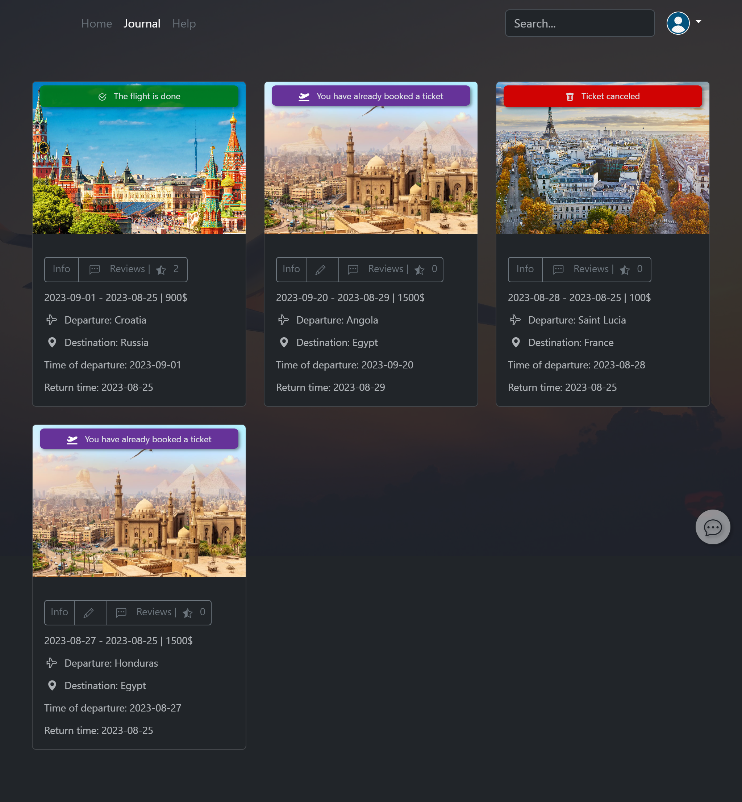

# ICR Project

Run f_b(frond - backend) only by Apache, nginx,...

But you can run by this command: cd f_b and composer run sta

Link: [http://localhost:3001](http://localhost:3001/f_b/)/

Github respository: [https://github.com/Marko9827/ICR](https://github.com/Marko9827/ICR "Git respository")

# Required for starting project

* Anaconda: [https://www.anaconda.com/download](https://www.anaconda.com/download)
* Python: [https://www.python.org/downloads/](https://www.python.org/downloads/)
* PHP 7.4 or 8.*
* C++
  * Download for: [ARM64](https://aka.ms/vs/17/release/vc_redist.x64.exe)
  * Download for: [X86](https://aka.ms/vs/17/release/vc_redist.x86.exe)
  * Download for: [X64](https://aka.ms/vs/17/release/vc_redist.x64.exe)
  * More info: [https://learn.microsoft.com/cpp](https://learn.microsoft.com/cpp)

# Screenshots

This is what the home page looks like, with available flights. Every flight has an Info I Book a ticket button.
Registration is required for Book a ticket.

Show available tickets in chatbot

Purchase/Reservation of tickets for the selected flight, Airport of departure, time and arrival and number of seats.

Information about one of the destinations [Full screenshot of the page]

Journal view of tickets [ Completed (flight, green) , upcoming (purple), and canceled (order) ]

